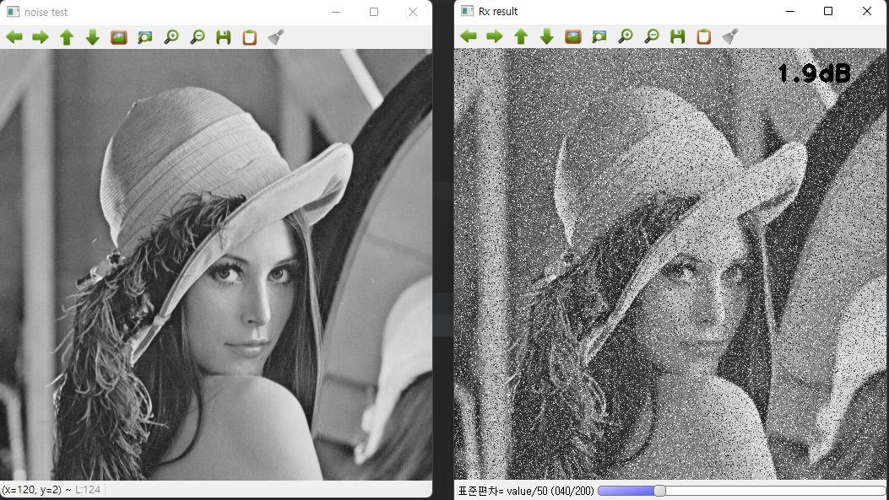
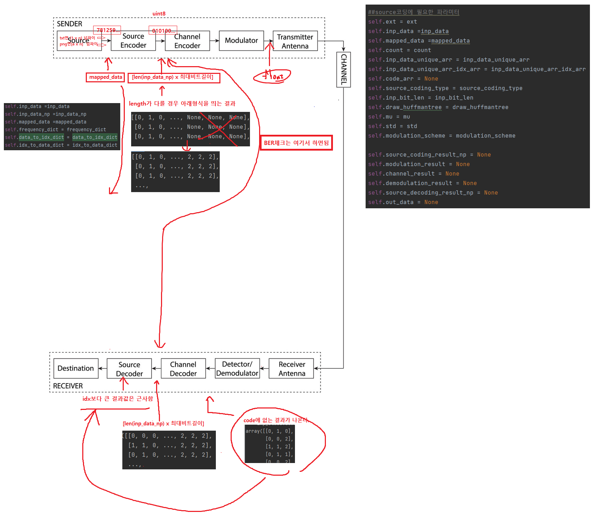
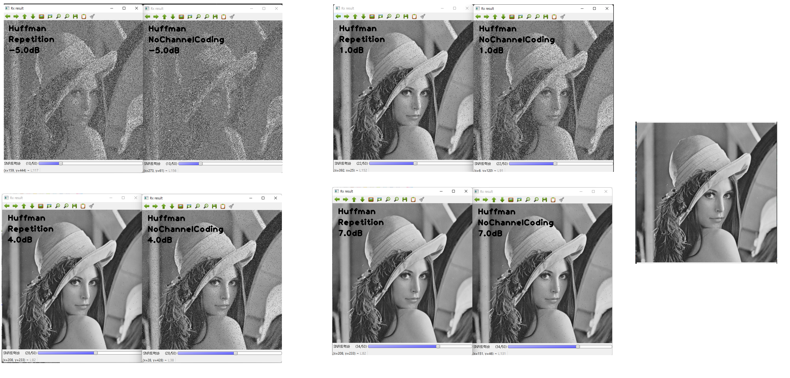

# simulation 예시 

# Communication System

# Huffman Tree


# Repetition code 성능



코드 수정 목록
```python
# 시작 _ 11.03
# Nocompression _ 11.26
# Repetition_code _ 11.30
```

## Dependencies
python 3.10

### Packages
```
numpy
opencv
```

### How to install
1. env
```sh
conda create -n communicationsystem python=3.10
```
2. activate
```sh
activate communicationsystem
cd PycharmProjects\communicationsystem
```

3. install requirements
```sh
conda install --file requirements_conda.txt
``` 

## How to run

```sh
python trans_img_simulator.py
``` 
